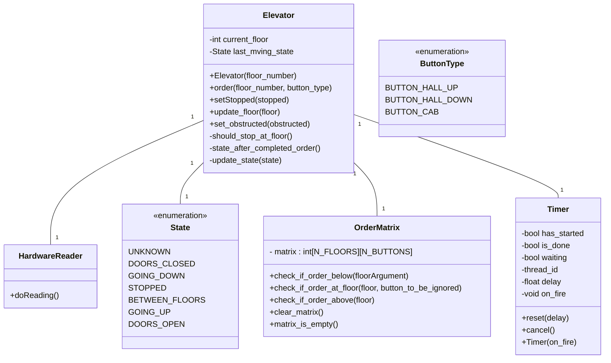
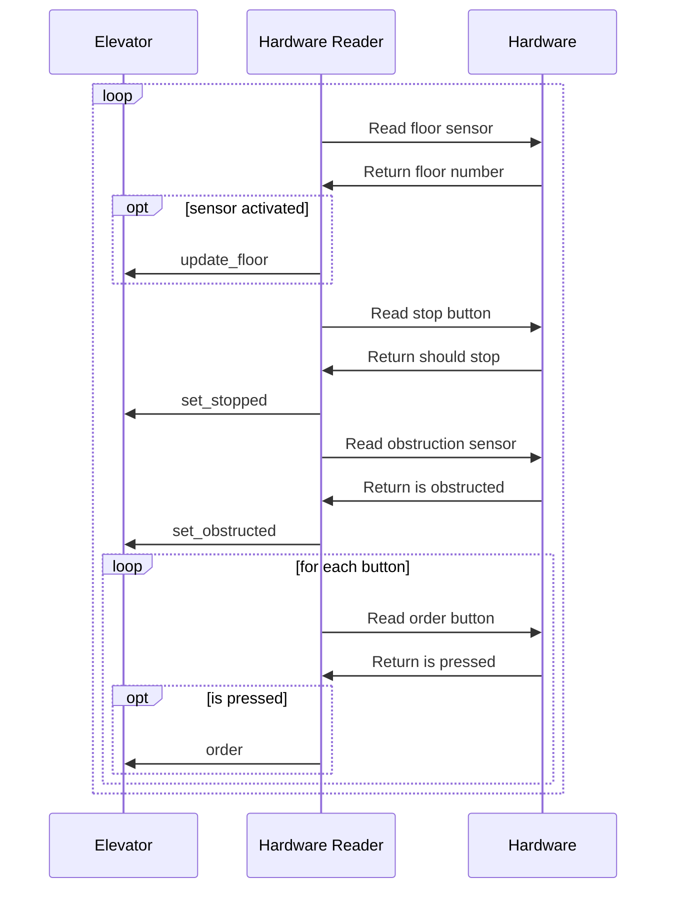
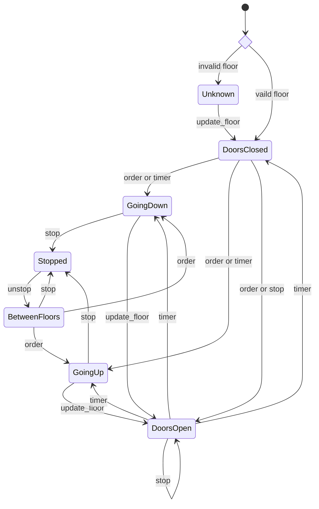

# Docs

Welcome to docs. For the report, please see [docs/report.pdf](/report/report.pdf).

## A.1 Arcitecture

### A.1.1 Elevator

```mermaid
classDiagram
    Elevator "1" -- "1" HardwareReader
    Elevator "1" -- "1" State
    Elevator "1" -- "1" OrderMatrix
    Elevator "1" -- "1" Timer

    class Elevator {
        -int current_floor
        -State last_mving_state

        +Elevator(floor_number)
        +order(floor_number, button_type)
        +setStopped(stopped)
        +update_floor(floor)
        +set_obstructed(obstructed)
        -should_stop_at_floor()
        -state_after_completed_order()
        -update_state(state)
    }

    class Timer {
        -bool has_started
        -bool is_done
        -bool waiting
        -thread_id
        -float delay
        -void on_fire

        +reset(delay)
        +cancel()
        +Timer(on_fire)
    }

    class OrderMatrix {
        - matrix : int[N_FLOORS][N_BUTTONS]

        +check_if_order_below(floorArgument)
        +check_if_order_at_floor(floor, button_to_be_ignored)
        +check_if_order_above(floor)
        +clear_matrix()
        +matrix_is_empty()
    }

    class State {
        <<enumeration>>
        UNKNOWN
        DOORS_CLOSED
        GOING_DOWN
        STOPPED
        BETWEEN_FLOORS
        GOING_UP
        DOORS_OPEN
    }

    class ButtonType {
        <<enumeration>>
        BUTTON_HALL_UP
        BUTTON_HALL_DOWN
        BUTTON_CAB
    }

    class HardwareReader {
        +doReading()
    }
```

### A.1.2 Event Loop

```mermaid
sequenceDiagram
    participant E as Elevator
    participant HR as Hardware Reader
    participant H as Hardware

    loop
        HR->>H: Read floor sensor
        H->>HR: Return floor number
        opt sensor activated
            HR->>E: update_floor
        end

        HR->>H: Read stop button
        H->>HR: Return should stop

        HR->>E: set_stopped

        HR->>H: Read obstruction sensor
        H->>HR: Return is obstructed
        HR->>E: set_obstructed

        loop for each button
            HR->>H: Read order button
            H->>HR: Return is pressed
            opt is pressed
                HR->>E: order
            end
        end
    end

```

## A.2 Modules

### A.2.1 State Machine

```mermaid
stateDiagram-v2
    state fork_state <<choice>>
    [*] --> fork_state

    fork_state --> Unknown : invalid floor
    fork_state --> DoorsClosed : vaild floor

    Unknown --> DoorsClosed : update_floor

    DoorsClosed --> GoingDown : order or timer
    DoorsClosed --> GoingUp : order or timer
    DoorsClosed --> DoorsOpen : order or stop
    DoorsOpen --> DoorsOpen : stop

    GoingUp --> Stopped : stop
    GoingDown --> Stopped : stop
    Stopped --> BetweenFloors : unstop
    BetweenFloors --> Stopped : stop
    BetweenFloors --> GoingUp : order
    BetweenFloors --> GoingDown : order


    GoingUp --> DoorsOpen : update_floor
    GoingDown --> DoorsOpen : update_floor
    DoorsOpen --> DoorsClosed : timer
    DoorsOpen --> GoingDown : timer
    DoorsOpen --> GoingUp : timer
```
