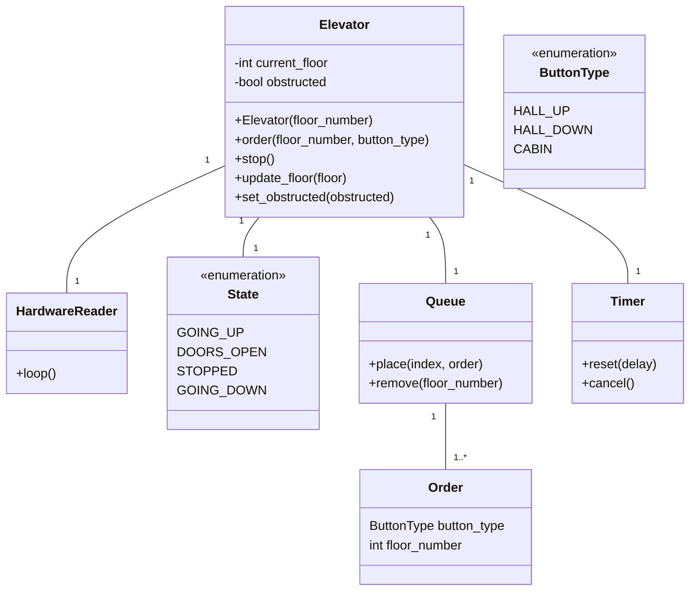

# Docs

Welcome to docs.

## A.1 Arcitecture

### A.1.1 Elevator



### A.1.3 Communication


## A.2 Modules

### A.2.1 State Machine


```python

reader = HardwareReader()
floor = reader.read_floor()
elevator = Elevator(floor)

while True:
    reader.loop()

```

