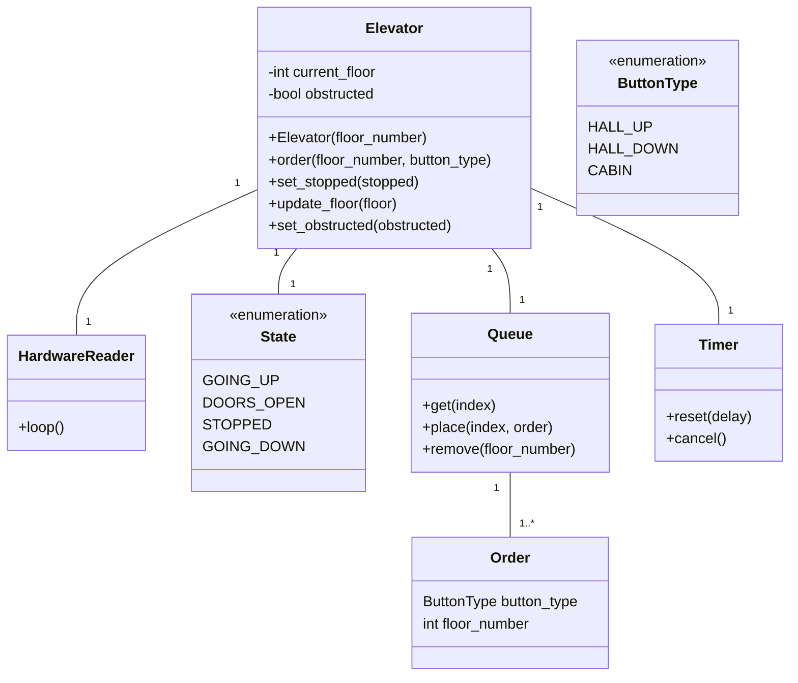
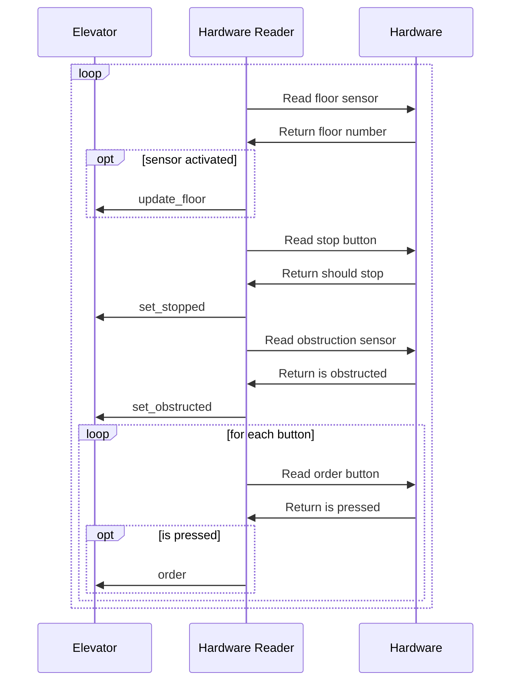
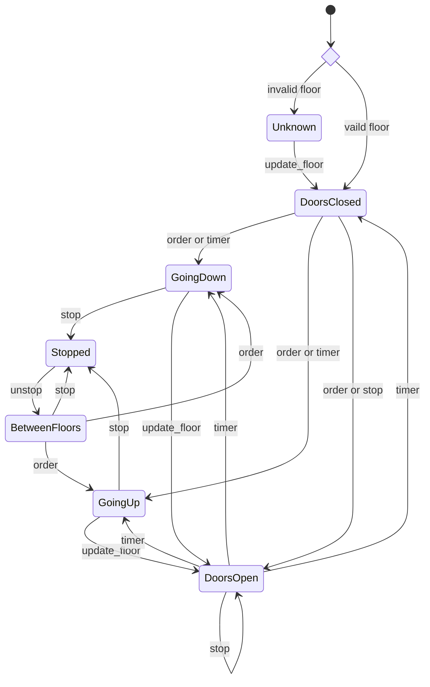
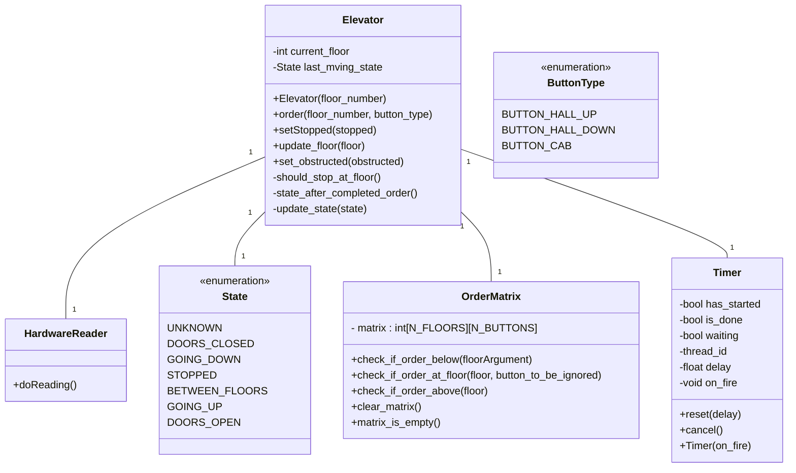

# Rapport

## Forfattere

Dette prosjektet er utført av **Emil Gaustad** og **Emil Djupvik**. Gruppenummer **24**.

## Innledning

Dette prosjektet er gjennomført som en del av emnet TTK4235 Tilpassede datasystemer, og omhandler design og implementasjon av en heiskontroller i C. Målet har vært å lage et system som styrer en fysisk heismodell med fire etasjer.

Systemet er bygget opp rundt en sentralisert `Elevator`-modul som håndterer tilstandsmaskinen for heisen. `HardwareReader`-modulen leser fra sensorene: etasjesensor, stoppknapp, obstruksjonssensor og bestillingsknapper, og videresender hendelsene til `Elevator`-modulen. Bestillinger lagres i en `OrderMatrix`, og en `Timer`-modul brukes til å styre dørlukkingen med et fast tidsforsinkelse som styres av en annen tråd.

## Designhistorie

Vårt originale design så slik ut

### A.1.1 Elevator

### A.1.2 Event Loop

### A.2.1 State Machine

Under utviklingen, oppdaterte vi dette designet til dette:

### A.1.1 Elevator

Der **A.1.2** (Event Loop) forble uendret. De mest vesentlige endringene finnes i **A.1.1** `Elevator` modulen. Først planla vi å bruke en enkel liste for å holde styr på ordre som skal ekspederes. Dette skulle vi implementere ved å sette inkommende ordre inn på hensiktsmessige plasser når vi blir spurt om det, og deretter ekspedere de i den rekkerfølgen de står i. Vi fant ut av at det var smartere å bruke en ordre-matrise som holder styr på hvilke knapper i hvilke etasjer som har blitt trykket på og som må ekspederes. Denne matrisen leses fra når vi ankommer en etasje (for å avgjøre om vi skal ekspedere i etasjen), og etter en ordre har blitt ekspedert (for å finne ut om vi skal lukke dørene, gå opp eller gå ned). Matrisen skrives til når vi ekspederer ordre, og når vi plasserer en ordre.

### Tilstandsmaskinen

I UML-tilstandsmaskiner skal egentlig tilstandsmaskinen motta en hendelse (_event_), og selve maskinens struktur definerer hvilke _actions_ som utføres og hvilke tilstandsoverganger som skjer. En eksplisitt `update_state`-funksjon hører egentlig ikke hjemme i en UML-tilstandsmaskin. Det er tilstandsmaskinen selv som skal drive atferden, ikke hendelseshåndtererne.

Vi viket fra dette prinsippet. I stedet for at tilstandsmaskinen styrer overgangene, leser hver hendelsefunksjon, `order`, `set_stopped`, `update_floor` og `set_obstructed`, tilstandsvariabelen direkte og inneholder eksplisitt logikk for hva som skal skje i hver tilstand. På slutten av denne logikken kalles `update_state` eksplisitt med den nye tilstanden.

For eksempel sjekker `set_stopped` manuelt om `elevator->state` er `GOING_UP`, `GOING_DOWN`, `BETWEEN_FLOORS` eller en av de stående tilstandene, og kaller `update_state` deretter. Tilsvarende leser `order` både tilstanden og `order_matrix` direkte for å bestemme om heisen skal åpne dørene, sette i gang i en retning, eller bare registrere ordren.

Vi brukte denne løsningen fordi det hadde vært noe tungvindt å gjøre tilstandsmaskinen til en selvstendig modul i dette prosjektet. Men dersom vi hadde prioritert skalerbarhet, ville det antageligvis lønnet seg å gjøre det ordentlig.

## UML og V-modellen

Det var nyttig for oss å bruke UML og V-modellen fordi vi kunne bli enige om hvordan de ulike modulene skulle jobbe sammen slik at vi kunne jobbe på hver våre moduler samtidig. Samarbeidet ble altså bedre med UML og V-modellen. I tidligere prosjekter har vi erfart at det er veldig vanskelig å kommunisere om implementasjonsdetaljer uten diagram. UML-diagram gir oss også oversikt over hva vi har tenkt, som er nyttig å se på under selve implementasjonen.

### Testing

En del av V-modellen innebærer modultesting. Dette kan gjøres automatisk med enhetstester. Vi har oppdatert Makefile filen slik at `make test` kjører c filene i `tests` mappen, som tester modulene `OrderMatrix` og `Timer`. Dette er nyttig fordi:

1. Det sikrer at moduelene fungerer isulert
2. Det sikrer at man oppdager eventuelle feil introdusert i endringer
3. Testene illustrerer hvordan man bruker modulen. Dette er nyttig for andre utviklere og utvikleren selv i fremtiden.

## KI

Vi har ikke brukt KI til å generere noe kode _direkte_. I stedet har vi brukt KI til å generere eksempelkode av for eksempel hvordan man lager en thread i c eller et mermaid diagram. Dette sparer oss for tiden det tar å gjøre dette ved å søke på nettet eller gjennom prøving og feiling.

Vi har heller ikke brukt KI til å tips til det overordnete designet vårt.
